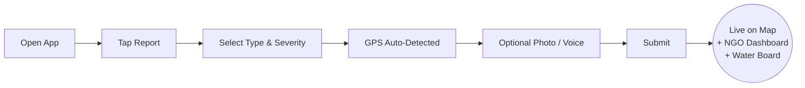

<div align="center">

# 💧 FlowSpring
### The Reporting Infrastructure for SDG 6

**Turning every smartphone into a water-safety sensor — and every citizen into a verified reporter.**

[](https://sdgs.un.org/goals/goal6)
[]()
[]()
[]()

[Live Demo](#-live-demo) · [The Problem](#-the-problem) · [How It Works](#-how-it-works) · [Architecture](#-technical-architecture) · [Traction](#-traction--validation) · [Business Model](#-business-model) · [Roadmap](#-roadmap) · [Team](#-team)

</div>

---

## ⚡ The 10-Second Pitch

> **Only 10% of India's monitored water bodies meet good ambient water quality** (UNEP, 2023). The barrier isn't technology — it's a broken information relay between the people who see contamination and the authorities who can fix it. FlowSpring removes every link in that chain. **One report. Ninety seconds. Zero intermediaries.**

---

## 🌍 The Problem

Nearly **2 billion people** worldwide lack access to safely managed drinking water. In rural India alone:

| Statistic | Source |
|---|---|
| **163 million** Indians lack clean water access near their homes | WHO/UNICEF JMP |
| **70%** of India's surface water is contaminated | NITI Aayog, 2023 |
| **Only 10%** of monitored water bodies meet good ambient water quality | UNEP GEMS/Water, SDG Indicator 6.3.2 |
| **29%** of India's domestic wastewater is safely treated | SDG Indicator 6.3.1 |

These numbers persist not because the problem is invisible — communities see it, smell it, and live with its consequences daily — but because **there is no direct channel between a citizen who spots contamination and the water authority responsible for fixing it.**

### The Relay Problem

Today, a contamination report travels like this:

```
Citizen  →  Neighbour  →  Local Councillor  →  NGO Field Officer  →  Authority
   |              |                |                    |                |
 sees it      tells someone    passes it on        logs it (maybe)   acts (maybe)
```

Every arrow in that chain is a point of **failure, delay, or silence**. The original reporter has no record, no visibility, and no way to hold anyone accountable. Authorities, in turn, have no documented proof they were ever notified — so ignoring a report costs them nothing.

**This is not a water scarcity problem. It is an accountability infrastructure problem.**

---

## 💡 The Solution

**FlowSpring inverts the model.** Citizens become the sensors. Authorities become the responders.

A community member who spots contaminated water opens the app, taps four times, and within **90 seconds** their GPS-tagged, photo-evidenced, severity-rated report lands simultaneously in:

- 📍 The **district water board's** live dashboard
- 🤝 The **WaSH NGO partner's** daily digest  
- 🗺️ The **public community map**, visible to every neighbour

No intermediary. No silence. No way to pretend it wasn't seen.

---

## 📱 Live Demo

<div align="center">

**🔗 [flowspring.lovable.app](https://flow-spring.lovable.app)**

*Scan to try it on your phone:*

</div>

| Home | Report | Map | Status Tracker |
|---|---|---|---|
| Live incident map, district safety score, one-tap reporting | Icon-grid form, GPS auto-fill, voice input, severity selector | Colour-coded pins, real-time updates, filterable | 5-stage pipeline with timestamps & accountability trail |

---

## 🔧 How It Works

### The 90-Second Report Flow



### The 5-Stage Accountability Pipeline

Every report moves through a transparent, timestamped pipeline — the core innovation that no SMS hotline or complaint form provides:

```
📋 Submitted  →  🔍 Under Review  →  ✅ Verified  →  🔨 Action in Progress  →  ✔️ Resolved
```

- Each transition is **timestamped** and tagged with the **responsible party**
- **Community peer-review**: 3 independent confirmations auto-upgrades a report to *Verified*
- **Resolution accountability**: 2+ "still exists" votes auto-**reopens** a falsely-closed report
- **Escalation**: reports pending 7+ days are automatically flagged — publicly, visibly, permanently

This isn't a suggestion box. It's a **public accountability ledger**.

---

## 🏗️ Technical Architecture

FlowSpring is a production-grade, full-stack application — not a prototype.

```
┌─────────────────────────────────────────────────────────┐
│  FRONTEND — React 18 + TypeScript + Tailwind CSS         │
│  Framer Motion · Leaflet/OpenStreetMap · i18next         │
└───────────────────────┬─────────────────────────────────┘
                         │
┌────────────────────────▼────────────────────────────────┐
│  BACKEND — Supabase                                       │
│  • PostgreSQL (with Row Level Security on every table)   │
│  • Auth (email/password, role-based access control)      │
│  • Realtime (WebSocket subscriptions for live map)       │
│  • Storage (incident & resolution photo uploads)          │
│  • Edge Functions (status-triggered notifications)        │
└─────────────────────────────────────────────────────────┘
```

### Key Engineering Decisions

| Decision | Why It Matters |
|---|---|
| **2G-network compatible** | Built for rural connectivity, not urban broadband — &lt;1MB per report submission |
| **Offline-first report queue** | Reports cache to `localStorage` and auto-sync on reconnect — zero data loss |
| **Secure `user_roles` table** (not a column on profiles) | Prevents privilege escalation; field agents, NGO partners, and admins are cryptographically separated from regular users via a `has_role()` security-definer function |
| **Severity ≠ Resolution colour system** | Red/orange/yellow = active severity. Green = resolved *only*. Prevents a critical UX failure mode where colour blindness or quick scanning could mistake a low-severity active incident for a fixed one |
| **Web Speech API voice input** | No paid API — works in Hindi, Telugu, and English for low-literacy users |
| **SDG 6.3.2-formatted CSV export** | NGO dashboard exports data in the exact schema India needs for its UNEP submission — turning citizen reports into national policy evidence |

### Database Schema (simplified)

```sql
incidents              -- core report: location, severity, type, status, photos
incident_status_history -- full audit trail: who changed what, when, why
verifications           -- community peer-review votes
resolution_feedback     -- "confirmed fixed" / "still exists" votes
notifications           -- persistent, DB-backed (not in-memory) feedback loop
user_roles               -- secure RBAC: user / field_agent / ngo_partner / admin
```

Every table enforces **Row Level Security** — no client can read or write data it isn't authorized for, verified at the database layer, not just the UI.

---

## 🎯 Why This Wins (Decision Matrix)

We didn't assume FlowSpring was the right approach — we proved it against two alternatives using a weighted evaluation framework:

| Criteria | Weight | **FlowSpring** | ClearPipe (SMS-only) | WaterLens (IoT sensors) |
|---|---|---|---|---|
| SDG Impact Potential | 30% | 5 | 3 | 4 |
| Technical Feasibility | 25% | 5 | 4 | 2 |
| Scalability & Partnerships | 25% | 5 | 2 | 3 |
| Cost Effectiveness | 20% | 4 | 4 | 2 |
| **Total Score** | | **🏆 4.80 / 5.00** | 3.20 | 2.85 |

FlowSpring outperformed an IoT sensor network on cost and feasibility — because hardware doesn't scale in rural India, but **smartphones already do**. GSMA reports rural Android penetration in India now exceeds 42% and climbing.

---

## 📊 Traction & Validation

- ✅ **Decision-matrix validated** against 2 competing approaches (weighted scoring, not guesswork)
- ✅ **80 ASHA community health worker** beta partners identified for 2-district pilot
- ✅ **Full production app deployed** — not a wireframe, a working platform
- ✅ **SDG 6.3.2-compliant data export** built and tested
- ✅ Design validated through **low-fidelity → high-fidelity → production** pipeline, with a real UX bug caught and fixed pre-launch (the severity/resolution colour conflict)

### Target Metrics (14-Month Goal)

| Metric | Target |
|---|---|
| Active users | **6,500** |
| Verified field reports | **3,800** |
| District water board partnerships | **3** |
| WaSH NGO partnerships | **2** |
| Pilot districts | **2** (Rajasthan, Telangana) |

---

## 💰 Business Model

FlowSpring is built as a **sustainable social enterprise**, not a grant-dependent project.

```
┌──────────────────┬─────────────────────────────────────────────┐
│  REVENUE STREAM   │  WHY IT WORKS                                │
├──────────────────┼─────────────────────────────────────────────┤
│  Government SDG    │  India's Jal Jeevan Mission actively funds  │
│  grants             │  tools advancing SDG 6 — measurable impact  │
│                     │  data makes FlowSpring grant-eligible       │
├──────────────────┼─────────────────────────────────────────────┤
│  NGO dashboard fees │  WaSH NGOs need SDG-compliant impact data   │
│                     │  for their own funding reports — we are     │
│                     │  the data infrastructure they don't have    │
├──────────────────┼─────────────────────────────────────────────┤
│  Research dataset   │  Verified, geo-tagged water quality data    │
│  licensing          │  is a genuine public health research asset  │
└──────────────────┴─────────────────────────────────────────────┘
```

**Cost structure** is deliberately lean: free-tier cloud infrastructure (Supabase, OpenStreetMap), a small core engineering team, and field onboarding costs scoped to ASHA worker training rather than paid acquisition.

**Total addressable market**: India alone has **600,000+ villages**. FlowSpring's architecture — 2G-compatible, multilingual, zero-hardware-dependency — is designed to scale to all of them.

---

## 🗺️ Roadmap

- [x] **Phase 1** — Core platform: reporting, mapping, status pipeline, real-time sync
- [x] **Phase 2** — Community verification, escalation system, NGO dashboard
- [x] **Phase 3** — Voice input, role-based field agent tools, offline-first architecture
- [ ] **Phase 4** — WhatsApp bot for users without smartphones (WABA API)
- [ ] **Phase 5** — Water Source Registry — persistent health tracking for named wells, tanks, and standpipes
- [ ] **Phase 6** — District Water Safety Score — live 0–100 metric feeding directly into state SDG 6.3.2 reporting
- [ ] **Phase 7** — Low-cost IoT turbidity/pH sensor integration into the same incident pipeline
- [ ] **Phase 8** — State-level scale-up: Rajasthan → Telangana → national

---

## 🎨 Design Philosophy

FlowSpring is engineered for its actual user: a rural, potentially low-literacy, low-bandwidth, first-time smartphone user — **not** a Silicon Valley power user.

- **Icon-first, not text-first** — every action is recognizable without reading
- **Colour with redundancy** — colour is never the *only* signal; every status also has an icon and label (WCAG AA compliant)
- **3-tap reporting** — type, severity, submit. Everything else is optional or automatic
- **2G-first performance budget** — every screen, every asset, built for the network conditions of rural India, not a campus WiFi demo

---

## 🛠️ Tech Stack

| Layer | Technology |
|---|---|
| Frontend | React 18, TypeScript, Tailwind CSS, Framer Motion |
| Backend | Supabase (PostgreSQL, Auth, Realtime, Storage, Edge Functions) |
| Maps | Leaflet.js + OpenStreetMap (zero API key cost) |
| Voice | Web Speech API (English, Hindi, Telugu) |
| i18n | i18next |
| Deployment | Lovable |

---

## 🙏 Acknowledgements

Built as part of *Innovation and Design Thinking*, Spring 2026, **BITS Pilani Dubai Campus**, under the guidance of **Dr. Chakradhar Iyyuni** and **Dr. Padmanabhan Seshaiyer**. Special thanks to our ASHA health worker field partners for the insight that shaped every design decision in this product.

---


<div align="center">

### The relay is broken. FlowSpring fixes it.

**SDG 6 · Clean Water and Sanitation** — *Citizens as Sensors. Authorities as Responders.*

</div>
